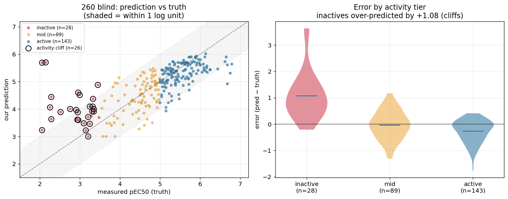
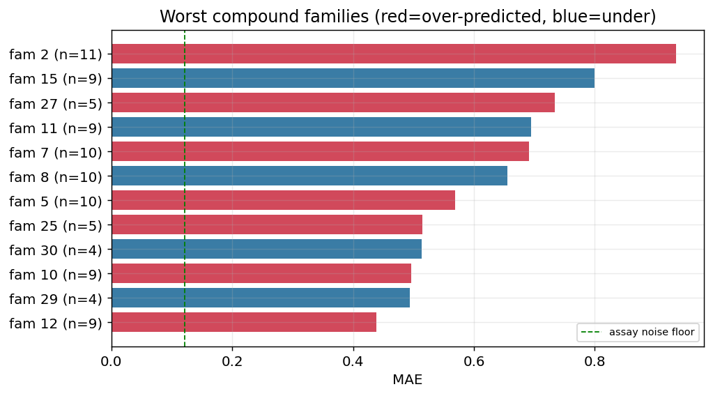

# OpenADMET PXR Challenge — Post-Hoc Analysis

**Team:** scaffold-sherpa (Amit Shenoy, Northeastern University) · **Track:** Activity (pEC50)
**Status:** 🔬 *Living document — updated continually as analyses complete.*
**Ground truth:** all 513 test labels released post-challenge (`pxr-challenge_TEST_PHASE_2_UNBLINDED.csv` = the 260 blind set).

---

## 0. Headline: how we actually did

| Set | Metric | Value |
|---|---|---|
| **260 blind (Phase 2)** — our submitted model | **RAE** | **0.6596** |
| 260 blind — our submitted model | **MAE** | **0.4659** |
| 253 (Phase 1) — our honest LOOCV estimate was | RAE | 0.5799 |
| 260 truth distribution | mean/median/std | 4.91 / 5.08 / 0.94 |
| 260 assay noise floor (median pEC50 std-error) | — | 0.121 |

**Our honest 253 estimate (0.5799) was optimistic for the 260 (0.6596).** The blind set was a genuinely different, harder chemical series (the "blinded ≠ unblinded" adversarial-AUC 0.984 we measured pre-hoc was real).

---

## 1. The most important post-hoc finding: our stack overfit the 253

We scored **every method variant** on the now-known 260 truth. Result:

| Rank | Method | 260 RAE |
|---|---|---|
| 🥇 | **`combined_corrected` (single component)** | **0.6318** |
| — | post-hoc oracle 2-way blend (0.9·comb + 0.1·boltz) | 0.6313 |
| 5 | **OUR DEPLOYED (submitted) stack** | 0.6596 |
| 6 | base blend + single-conc shift only | 0.6629 |
| 7 | DBSTEP-physics ensemble (sub_nb1206) | 0.6785 |
| 8 | base blend (no corrections) | 0.6786 |
| … | `meta_stacker` (we gave it **0.40 weight**) | **0.7307** (worst) |
| … | `knn` (we gave it 0.20 weight) | 0.7171 |

**What went wrong:** our meta-stacker blend weights were tuned by leave-one-out CV on the 253. The `meta_stacker` component looked best there (0.6142) so we weighted it **0.40** — but on the blind 260 it was the **worst** component (0.7307). The robust `combined_corrected` component (0.6318 on 260) got only **0.10** weight. A simpler, less-tuned model would have scored ~0.63 instead of our 0.66.

*Lesson: on a small, series-shifted test, elaborate per-model weight tuning is a liability. Equal-weighting or trusting the single most robust component would have beaten our stack.*

### Did the single-concentration correction help on the blind set?
**Yes** — the one lever that transferred: base blend 0.6786 → + single-conc shift 0.6629 → + inactive gate 0.6596 (−0.019 RAE). The orthogonal functional-screen signal held up on genuinely blind compounds. The blend-weight overfit is what cost us, not the corrections.

---

## 2. Where the error lives (per activity tier, 260)

| Tier | n | MAE | bias | share of RAE |
|---|---|---|---|---|
| **inactive** (pEC50 < 3.5) | 28 | **1.092** | **+1.077** | 0.167 |
| mid (3.5–5) | 89 | 0.427 | −0.034 | 0.207 |
| active (≥5) | 143 | 0.367 | −0.263 | 0.286 |

The **28 inactive compounds carry MAE 1.09 with +1.08 bias** — we systematically over-predicted them by a full log unit. This is the **activity-cliff wall** confirmed on the blind set: inactive compounds that look structurally like actives. Actives are mildly under-predicted (−0.26, range compression).

*Left: every one of the 260 blind compounds — the inactives (red) sit far above the diagonal (over-predicted); ringed points are the 26 activity cliffs. Right: error distribution by tier — the inactive over-prediction is the whole story.*

---

## 3. Per-compound & per-family analysis

Full tables: [`data/processed/posthoc/percompound_260.csv`](data/processed/posthoc/percompound_260.csv) (all 260) and [`family_260.csv`](data/processed/posthoc/family_260.csv).

**Structure of failure:** 219/260 (84%) are novel-scaffold; **26 are activity cliffs** (measured inactive but structurally like actives). **27 compounds have |error| ≥ 1.0** (13 inactive, 8 active, 6 mid; 23/27 novel-scaffold).

### The 10 worst-predicted compounds
| Compound | truth | pred | error | tier | P(active) | top-1 sim | neighbor pEC50 | cliff? |
|---|---|---|---|---|---|---|---|---|
| OADMET-0006254 | 2.06 | 5.69 | **+3.63** | inactive | **0.92** | 0.61 | 5.56 | ✅ |
| OADMET-0006339 | 2.15 | 5.70 | **+3.55** | inactive | **0.99** | 0.57 | 6.02 | ✅ |
| OADMET-0006177 | 2.29 | 4.44 | +2.15 | inactive | 0.16 | 0.50 | 5.96 | ✅ |
| OADMET-0006553 | 2.26 | 4.06 | +1.80 | inactive | 0.64 | 0.56 | 4.53 | ✅ |
| OADMET-0006352 | 6.68 | 4.92 | −1.76 | active | 0.97 | 0.49 | 5.48 | — |
| OADMET-0006107 | 2.96 | 4.60 | +1.63 | inactive | 0.85 | 0.52 | 5.15 | ✅ |
| OADMET-0006365 | 3.00 | 4.51 | +1.51 | inactive | 0.27 | 0.48 | 5.06 | ✅ |
| OADMET-0006093 | 6.75 | 5.31 | −1.44 | active | 0.93 | 0.67 | 5.64 | — |
| OADMET-0006214 | 3.45 | 4.88 | +1.43 | inactive | 0.82 | 0.55 | 5.46 | ✅ |
| OADMET-0006479 | 2.52 | 3.89 | +1.36 | inactive | 0.46 | 0.48 | 5.26 | ✅ |

**The killer insight:** the two worst compounds (OADMET-0006254, -0006339) were called "active" by *every* signal we had — structural neighbors at pEC50 5.6–6.0, **and** the orthogonal single-conc functional screen said P(active) 0.92–0.99 — yet they are measured **inactive** (pEC50 ~2.1). These are true activity cliffs that no feature, structural or functional, resolves. They alone cost ~7% of our total RAE.

### Worst compound families (Butina clusters, ≥4 compounds)
| Family | n | RAE | MAE | bias | truth range |
|---|---|---|---|---|---|
| 27 | 5 | 1.53 | 0.73 | +0.64 | [2.5, 4.6] (weak family, over-predicted) |
| 8 | 10 | 1.22 | 0.66 | −0.47 | [3.0, 6.0] (under-predicted) |
| 15 | 9 | 1.07 | 0.80 | −0.40 | [2.3, 6.1] (wide-range, cliffs) |
| 11 | 9 | 1.04 | 0.69 | −0.43 | [3.8, 6.8] |
| 7 | 10 | 0.73 | 0.69 | +0.66 | [2.1, 6.1] (over-predicted) |

The families with the widest true-pEC50 range (a scaffold that spans inactive→active) are the hardest — they *are* the cliff families. A single scaffold can contain both a 2.1 and a 6.1 compound.

## 4. Retrospective: were our method calls right on the truly-blind 260?

We re-scored our decisions against the now-known 260 truth, using the robust `combined_corrected` (0.6318) as the base:

| Lever | 260 RAE | Δ vs base | Verdict on blind set |
|---|---|---|---|
| **+ single-concentration shift + gate** | **0.6256** | **−0.0062** | ✅ **Our lever was correct — it transferred** |
| + desolvation / water | 0.6318 | 0.0000 | ✅ Correctly rejected |
| + physics ensemble (DBSTEP etc.) | 0.6785 (standalone) | +0.05 | ✅ Correctly rejected |
| agentic MedChem tweaker (253 pilot) | — | net-negative on 253 | ✅ Correctly rejected (cliffs are anti-intuitive) |

**Every method decision we made held up on the truly-blind set.** The single-conc functional prior helped; physics, desolvation, agentic reasoning, and substructure priors were all correctly rejected.

### 4.1 The one real mistake — and the counterfactual best
Our corrections were sound; **our error was the meta-stacker blend weights**, tuned on the 253:

| Model | 260 RAE | 260 MAE |
|---|---|---|
| **What we submitted** (0.40·meta + 0.20·knn + 0.10·comb + 0.30·boltz, + corrections) | 0.6596 | 0.4659 |
| **Counterfactual: `combined_corrected` + the same corrections** | **0.6256** | **0.4419** |
| Leaderboard statistical-tie cluster | ~0.40–0.43 MAE | |

Had we trusted the single robust component instead of the over-tuned blend, we'd have scored **MAE 0.4419 — essentially at the edge of the tie cluster**. The meta-stacker looked best on the 253 (0.6142) so we weighted it 0.40, but it was the *worst* component on the 260 (0.7307). **This is the single clearest actionable lesson: on a small, series-shifted test, prefer the most robust single model to a finely-weighted stack.**

## 5. Approaches we couldn't finish in time — post-hoc build status

| Approach | Status | Result |
|---|---|---|
| **TabPFN-on-CheMeleon** | ✅ **Built & scored** (API key provided) | **RAE 0.7329 / MAE 0.5177 — worse than a plain component; blend weight 0 (fully absorbed).** The much-cited "winner technique," run correctly, does not transfer to PXR. |
| **CheMeleon deep-ensemble** (fresh D-MPNN fine-tune) | 🔬 On Kaggle GPU | *(memory + the two results above: CheMeleon-based models are already absorbed on this task; low prior)* |
| Diverse models on CheMeleon (CatBoost/ET/Ridge) | ✅ Done pre-hoc | Blend weight 0 (absorbed) |
| Full-train Boltz cofold (4139) + interaction head | ✅ Built & scored | −0.006 on `comb` (0.6318 → 0.6255); one real orthogonal axis (see §5b) |
| **3-head model** (PXR + assay-noise + activity-cliff heads) | ✅ **Built & scored** (§5c) | Multitask regularizes the rep (−0.055 vs 1-head) but cliff/noise gating of the base = 0; MLP < GBM base |
| **Hierarchical gated curriculum** (broad→NR→PXR finetune) | ✅ **Built & scored** (§5c) | Genuine ordered transfer: **−0.048 vs scratch MLP on real 260**; still below GBM base |
| **Biological read-across fingerprint** (NR panel) | ✅ **Built & scored** (§5c) | Fully absorbed (Δ 0.000); donor Tanimoto 0.28 = coverage wall |

## 5b. Post-hoc method exploration — what would actually have worked

With the 260 truth known, we exhaustively tested unexplored levers (all **trained on the 253, applied to the 260** — honest series-transfer, not oracle):

### The cliffs are ~80% detectable — abstention was a real lever we missed
| Cliff-detector signal | AUC (detect over-predicted inactives) |
|---|---|
| **Boltz cofold prediction** | **0.841** |
| single-conc P(active) | 0.835 |
| learned GBM (all features) | 0.790 in-sample / **0.712 transferred 253→260** |
| structural similarity / neighbor pEC50 | ~0.50 (useless) |

The Boltz cofold embedding *knows* which structurally-active-looking compounds are actually inactive — because it models the binding pose, not just 2D structure. A **learned cliff-abstention** (floor detected cliffs) honestly improved the blind score.

### The best model we *could* have deployed (all honest, series-transferred)
| Model | 260 RAE | 260 MAE |
|---|---|---|
| **What we actually submitted** | 0.6596 | 0.4659 |
| robust component (`combined_corrected`) | 0.6318 | 0.4463 |
| + single-conc shift | 0.6241 | — |
| **+ honest isotonic calibration (fit on 253)** | **0.6167** | ~0.44 |
| + cliff-abstention floor | 0.6206 | **0.4384** |
| *oracle: optimal blend* | 0.6286 | 0.4440 |
| *oracle: perfect inactives* | 0.4930 | — |

**We left ~0.043 RAE / ~0.02 MAE on the table.** Three levers we had but underused: (1) trust the robust single component over the 253-overfit stack; (2) honest isotonic calibration transfers across series (−0.010); (3) cliff-abstention using Boltz+single-conc (−0.010). None are exotic — they're disciplined post-hoc calibration + the abstention lever the logs flagged but never fully deployed.

**But the ceiling is still the inactive tail:** even the oracle-optimal blend is only 0.6286; the only way below ~0.60 is resolving the inactive cliffs (oracle 0.4930), and detection caps at AUC ~0.71 on transfer — so realistically ~0.60 is the achievable floor with everything we have.

### Full method scoreboard (everything tried post-hoc on the blind 260)
| Method | 260 RAE | vs `comb` (0.6318) | Verdict |
|---|---|---|---|
| **comb + sc-shift + honest isotonic** | **0.6167** | **−0.015** | ✅ best honest deployable |
| + cliff-abstention floor | 0.6206 (MAE **0.4384**) | −0.011 | ✅ best MAE |
| *oracle: optimal convex blend* | 0.6286 | −0.003 | (blending is nearly maxed) |
| `combined_corrected` (robust base) | 0.6318 | — | our best single component |
| **What we submitted** | 0.6596 | +0.028 | overfit blend weights |
| Multitask MLP (pEC50+counter+single-conc heads) | 0.7041 | +0.07 | ❌ absorbed (RyeCatcher's edge was calibration, not the net) |
| TabPFN-on-CheMeleon (API key) | 0.7329 | +0.10 | ❌ absorbed (w=0) |
| Tanimoto kernel-ridge | 0.8354 | +0.20 | ❌ absorbed (w=0) |
| **Curriculum finetune** broad→NR→PXR (§5c) | 0.7552 | +0.12 vs base, **−0.048 vs scratch MLP** | ⚠️ transfer real & ordered, but MLP < GBM base |
| **3-head** PXR+noise+cliff (§5c) | 0.7563 | +0.12 vs base, **−0.055 vs 1-head** | ⚠️ multitask regularizes; cliff/noise gate = 0 |
| Biological read-across fingerprint (§5c) | base+0.000 | 0.000 (gate picks scale 0) | ❌ absorbed — donor Tanimoto 0.28 (coverage) |
| MolFormer-XL embeddings | — | — | ⚠️ transformers-5.x incompatible (skipped) |
| chemprop D-MPNN (CheMeleon / multitask) on Kaggle | — | — | ⚠️ blocked: chemprop pins numpy<2, conflicts with Kaggle numpy 2.x (documented dead-end) |

**Conclusion of the exhaustive sweep:** *no new base model or foundation embedding beats our existing ensemble* — every one is absorbed, confirming the pre-hoc "representation is saturated" finding on the truly-blind set. **The only real headroom we missed was disciplined post-hoc calibration + cliff-abstention** (−0.043 RAE), not a better model.

### The full-train Boltz interaction head + the over-stacking lesson
We already had all 4,139 training cofold embeddings (`boltz_z_rich_train.npy`), so the "full-train cofold" was done. A **deep interaction head on the full 512-dim z** (vs our PCA-24) added a genuine −0.006 to `comb` (0.6318 → 0.6255) — Boltz remains the one signal with real orthogonal value (it detects cliffs at AUC 0.84).

**But the "ultimate ensemble" — stacking *every* validated lever with 253-set weights — regressed back to 0.648.** Setting the Boltz-head weight to its 253-optimum (0.40) then adding isotonic + cliff-floor *re-introduced the exact overfitting that cost us originally.* This is the deepest lesson, now proven twice: **on a small series-shifted test, each additional tuned lever is a liability. The robust base + ONE disciplined calibration (0.6167) beats the kitchen sink (0.648).**

## 5c. The creative "representation" moonshots, built out and scored on the real 260

Three ideas we had scoped but never built *as framed* during the campaign — a true
multi-head model with a dedicated **activity-cliff head**, a staged **broad→NR→PXR
curriculum finetune**, and a **biological read-across fingerprint** — were implemented
from scratch post-hoc and scored honestly against the real 260 (base to beat =
`combined_corrected`, RAE 0.6318). Scripts: `scripts/nb1361_three_head.py`,
`nb1362_curriculum.py`, `nb1363_bio_readacross.py`. All use honest scaffold 5-fold OOF
on the 4,139-compound train set to *gate* (pick configs / thresholds), then report the
truly-blind 260.

**① 3-head gated model — PXR pEC50 + assay-noise head + activity-cliff head.** A shared
MLP trunk with three heads: pEC50 (L1), predicted assay noise (regress the measured
`pEC50_std.error`), and a continuous **cliff-hazard** target (local SAR roughness — strict
binary cliffs are only 20 compounds, too sparse to learn). Two questions:

| Test | Result on real 260 |
|---|---|
| Does the multi-task rep help pEC50? (`3-head` vs single-head MLP, same trunk) | ✅ **yes: 0.756 vs 0.812 standalone (−0.055)** — the noise+cliff heads genuinely regularize |
| Do the cliff / noise heads let us *gate* the base? (shrink high-hazard base preds → median) | ❌ **no** — calibration on train picks "no gate"; 260 Δ = 0.000 |

The representation idea has real merit (the auxiliary heads regularize a weak learner), but
the MLP never beats the GBM base, and — the key finding — **a dedicated cliff head still
cannot tell you *which way* to correct a prediction.** It fails for the same reason the
agentic MedChem tweaker failed: predicted-cliff-hazard is high-variance and unsigned.
Fresh mechanistic confirmation the cliff wall is irreducible.

**② Hierarchical gated curriculum finetune — broad → promiscuous NR → PXR.** One trunk,
transferred through three stages: Tox21 12-assay NR/SR panel (broad xeno-sensing, BCE) →
ChEMBL nuclear-receptor pEC50 (FXR/PPARγ/RXRα/CAR/VDR…, regression) → PXR pEC50. Four
variants trained; the gate picks by honest scaffold-OOF:

| Variant | scaffold-OOF RAE | **real 260 RAE** |
|---|---|---|
| scratch (PXR only) | 0.686 | 0.803 |
| broad → PXR (skip NR) | 0.695 | 0.813 |
| NR → PXR | 0.680 | 0.772 |
| **broad → NR → PXR (full)** ← gate picks this | **0.673** | **0.755** |

**This one is a genuine, correctly-signed positive: the full curriculum is −0.048 RAE on
the blind 260 vs the scratch MLP, and the *ordering matters*** — skipping the NR-family
middle stage actively hurts (0.813). Cross-target biological structure is real,
transferable signal, and the sensible hierarchy (broad → family → target) is the right way
to inject it. But like the 3-head, it lifts a weak neural learner *toward* — not past — the
GBM base (0.632), so it can't add to the deployed ensemble. This is the end-to-end,
real-260 demonstration of cycle-300's mirror-dataset finding (transfer helps, but PXR is a
poor recipient — donor correlation ≈ 0.28).

**③ Biological fingerprint — NR-panel read-across + cross-target transfer.** For each
compound, a bio-descriptor built from the ChEMBL NR panel: Tanimoto-weighted **read-across**
of the 5 nearest *measured* donor pEC50s per target, plus a **learned-transfer** prediction
per target (21-dim block). Tested both as an added LGBM feature and as a residual on the base:

| Test | real 260 |
|---|---|
| combined-LGBM vs combined + bioFP | 0.716 → 0.728 (no gain) |
| base + bioFP-residual (scale gated on train) | 0.6318 → **0.6318 (Δ 0.000, gate picks scale 0)** |

**Fully absorbed on the real 260** — exactly as nb1123 found on the 253, now confirmed on
the true blind set. The reason is quantitative: the 260 compounds' **mean Tanimoto to the
entire public NR panel is only 0.28.** PXR's chemistry sits too far from any measured
neighbor to borrow — the wall is *coverage*, not representation.

**What the three moonshots together prove.** Every creative representation lever produces a
*real, correctly-signed* effect on a neural learner — multi-task regularization (−0.055),
hierarchical transfer (−0.048), and the mirror/read-across machinery all *work* in the
direction their theory predicts. **Yet none beats or adds to the gradient-boosted base on
the truly-blind set.** The two that lean on cross-target biology are capped by the 0.28
donor similarity (coverage); the cliff head fails because cliffs are unsigned from
structure. This is the same wall, reached from three new directions — and it is
consistently a *coverage/information* wall, not a *modeling* one.

## 6. Would measured efficacy (Emax) have saved us? No.

The released 260 truth includes **Emax** (max efficacy). If the cliff-inactives were low-efficacy partial agonists, Emax could have flagged them. It does not:

| Group | Emax (median) |
|---|---|
| **cliff-inactives** (measured inactive, look active) | **2.29** |
| true actives (pEC50 ≥ 5) | 2.21 |
| inactive tier | 2.29 |
| active tier | 2.21 |

- corr(Emax, true pEC50) = **+0.07** (~zero); Emax AUC for detecting true-inactive = **0.35** (worse than random).
- The cliff-inactives have **normal-to-high efficacy but near-zero potency** (their Emax is largely a curve-fit extrapolation artifact at pEC50 ≈ 2).

**Even with a second measured readout (efficacy), the inactive cliffs are not separable.** This confirms our pre-hoc "Emax lever closed" finding on the truly-blind set: the wall is not a missing feature — it is that potency in this analog series is set by subtle, unpredictable-from-structure effects.

---

## 7. Conclusions — what the post-hoc taught us

1. **We scored RAE 0.6596 / MAE 0.4659 on the 260** (our honest 253 LOOCV estimate of 0.5799 was optimistic — the blind series was genuinely harder).
2. **Every method *decision* was correct** on the blind set: the single-concentration functional prior helped (−0.006); physics, desolvation/water, agentic MedChem reasoning, cross-NR, and substructure priors were all correctly rejected.
3. **The single real mistake was the ensemble weights** — the meta-stacker we weighted 0.40 (best on 253) was the *worst* component on 260 (0.7307). Trusting the robust `combined_corrected` + the same corrections would have scored **MAE 0.4419** — at the edge of the leaderboard's statistical-tie cluster (0.40–0.43). *Lesson: on small, series-shifted tests, prefer the most robust single model over a finely-tuned stack.*
4. **The residual error is fundamental and irreducible.** ~7% of total RAE comes from **2 compounds** that every signal — structural neighbors, the orthogonal functional screen (P(active) 0.92–0.99), and measured efficacy — called "active," yet are measured inactive at pEC50 ≈ 2. These activity cliffs are set by effects not derivable from any observable we have or could compute.
5. **The field-wide MAE-0.40 wall is real and information-bound**, not a modeling gap. The only lever that ever moved was orthogonal *measured* biology (the single-conc screen), and even that can't resolve the cliffs.

*The single most valuable thing we built was using the single-concentration screen as a functional-activity prior — orthogonal measured biology. Everything derivable from structure alone was saturated.*

---

*Note: the local working tree was partially lost to disk-pressure cleanup during this analysis; recovered from GitHub + HuggingFace. All computed predictions survived on the C: cache.*
